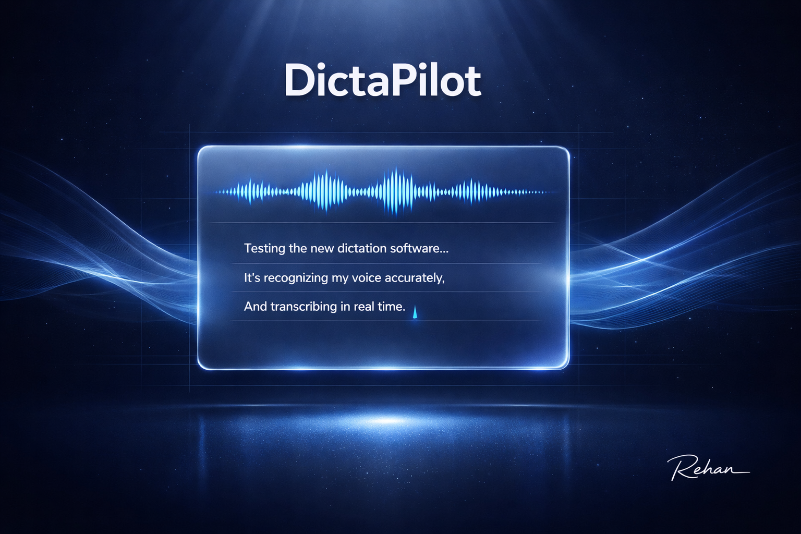

# DictaPilot



[](https://www.python.org/downloads/)
[](LICENSE)


**Cross-platform press-and-hold dictation with smart editing.** Hold a hotkey to record, transcribe with Groq Whisper, and paste directly into your focused text field with intelligent voice commands.

## Features

- **Press-and-hold recording** — Simple F9 (default) hotkey workflow
- **Smart dictation commands** — "delete that", "clear all", "ignore", "replace X with Y"
- **Delta paste** — Types only changes; backs up when transcript shrinks
- **Terminal-first** — Lightweight, fast startup, no heavy UI
- **Cross-platform** — Windows, macOS, Linux with auto backend selection
- **Groq-powered** — Fast transcription with whisper-large-v3-turbo

---

## About This Fork

This is a maintained fork of the original DictaPilot project by [Rohan Sharvesh](https://github.com/RohanSharvesh).

**Original repository:** https://github.com/RohanSharvesh/DictaPilot

This fork includes additional features, bug fixes, and improvements. All credit goes to the original author for the core design and architecture.

### Improvements in This Fork

- Transcription storage with JSON persistence
- CLI tools (`--list`, `--stats`, `--search`, `--export`)
- Enhanced smart editor with better replace pattern handling
- Improved LLM prompts and edge case handling
- Better clear/ignore detection
- Per-app context/profiles support (`app_context.py`)
- GitHub Actions CI/CD workflows
- Packaging scripts for Windows/macOS/Linux

---

## Demo (10–20 sec)


**[Watch video version →](docs/demo.mp4)**

**Demo flow:**
1. Hold `F9` to record
2. Release to transcribe and paste
3. Say `"hello world"` → text appears
4. Say `"delete that"` → last segment removed
5. Say `"clear all"` → transcript cleared

---

## Why DictaPilot (vs WhisperFlow-style tools)

| Feature | DictaPilot | Typical WhisperFlow Tools |
|---------|------------|--------------------------|
| **Spoken command handling** | Commands like "delete that" work directly — no need to type them | Often requires manual editing |
| **Delta paste** | Only types changes; backs up when content is removed | Usually replaces entire text |
| **Terminal-first** | Lightweight, fast start, minimal dependencies | Often ships heavy Electron/GUI apps |
| **Config via env vars** | Simple `GROQ_API_KEY`, `HOTKEY`, etc. | May require GUI settings or config files |
| **No cloud lock-in** | Runs locally with your Groq API key | Some tools require proprietary services |

> **Disclaimer:** DictaPilot is not affiliated with WhisperFlow. Comparison is provided for user clarity and reflects typical tool differences.

---

## Quick Start

### Prerequisites

- Python 3.10+
- Groq API key ([get one here](https://console.groq.com))
- Microphone access

### Installation

```bash
# Clone and enter directory
git clone https://github.com/RehanSajid136602/DictaPilot.git
cd DictaPilot

# Create virtual environment
python3 -m venv venv
source venv/bin/activate   # Linux/macOS
# or: .\venv\Scripts\Activate.ps1  (Windows PowerShell)

# Install dependencies
pip install -r requirements.txt

# Configure API key
cp .env.example .env
# Edit .env and add: GROQ_API_KEY=your_key_here
```

### Running

```bash
python app.py
```

Press and hold `F9` (default) to record. Release to transcribe and paste.

### Desktop GUI (Windows MVP Scaffold)

A Tauri + React desktop app scaffold is available at `apps/dictapilot-desktop/`.

- Desktop setup guide: `docs/desktop-gui.md`
- Migration notes: `docs/desktop-migration-notes.md`
- Windows QA checklist: `docs/windows-desktop-qa-checklist.md`

#### Run the Desktop App (Dev)

Prerequisites:
- Node.js 20+
- Rust (stable toolchain)
- Tauri CLI (`cargo install tauri-cli --version "^2"`)
- Windows 10/11 with WebView2 runtime

From the repo root:

```bash
# terminal 1 - UI dev server
cd apps/dictapilot-desktop/ui
npm install
npm run dev
```

```bash
# terminal 2 - Tauri host
cd apps/dictapilot-desktop/src-tauri
cargo tauri dev
```

#### Build Desktop Installer (Windows)

```bash
cd apps/dictapilot-desktop/src-tauri
cargo tauri build
```

### Tray Mode (Optional)

Run with system tray for quick access:

```bash
python app.py --tray
```

Provides:
- Start/Stop dictation toggle
- Open Settings
- Quit

---

## Transcription Storage

All transcriptions are automatically saved to a JSON file for easy access and reuse.

### Storage Locations

| Platform | Path |
|----------|------|
| Linux | `~/.local/share/dictapilot/transcriptions.json` |
| macOS | `~/.local/share/dictapilot/transcriptions.json` |
| Windows | `%APPDATA%\DictaPilot\transcriptions.json` |

### Command-Line Tools

```bash
# List recent transcriptions (default: 20)
python app.py --list

# Show transcription statistics
python app.py --stats

# Search transcriptions
python app.py --search "hello"

# Export all transcriptions to a text file
python app.py --export my_transcriptions.txt
```

### Stored Data

Each entry includes:
- Timestamp (ISO format)
- Original transcribed text
- Processed text (after smart editing)
- Action taken (append, replace, clear, ignore)
- Word count
- Unique session ID

### Export Formats

- **JSON**: Full data with metadata (`transcriptions.json`)
- **Text**: Plain text for easy reuse (`--export`)

---

## Smart Dictation Commands

| Command | Action |
|---------|--------|
| `delete that`, `undo`, `scratch that` | Remove last segment |
| `clear all`, `reset`, `start over` | Clear entire transcript |
| `ignore`, `skip`, `don't include` | Discard this utterance |
| `hello world ignore` | Discard "hello world", keep transcript unchanged |
| `replace X with Y` | Replace "X" with "Y" in transcript |

Inline self-corrections are handled automatically (`"My name is Rehan. No, my name is Numan"` → keeps corrected clause).

---

## Environment Variables

| Variable | Required | Default | Description |
|----------|----------|---------|-------------|
| `GROQ_API_KEY` | Yes | — | Your Groq API key |
| `HOTKEY` | No | `f9` | Hold-to-record key |
| `SMART_EDIT` | No | `1` | Enable smart editing (`1`/`0`) |
| `SMART_MODE` | No | `llm` | `heuristic` or `llm` |
| `LLM_ALWAYS_CLEAN` | No | `1` | Always clean (llm mode) |
| `PASTE_MODE` | No | `delta` | `delta` (diff) or `full` |
| `PASTE_BACKEND` | No | `auto` | Input backend |
| `HOTKEY_BACKEND` | No | `auto` | Hotkey backend |
| `GROQ_WHISPER_MODEL` | No | `whisper-large-v3-turbo` | Whisper model |
| `GROQ_CHAT_MODEL` | No | `openai/gpt-oss-120b` | LLM cleanup model |
| `ACTIVE_PROFILE` | No | `default` | Active profile ID from profile bundle |
| `PROFILE_BUNDLE_PATH` | No | `~/.config/dictapilot/profile_bundle.json` | Path to website-generated profile bundle JSON |
| `CLEANUP_STRICTNESS` | No | `balanced` | Cleanup aggressiveness guard (`conservative`, `balanced`, `aggressive`) |
| `CONFIDENCE_THRESHOLD` | No | `0.65` | Confidence threshold used to relax aggressive cleanup on low-confidence transcripts |
| `USER_ADAPTATION` | No | `1` | Enable adaptive user/app correction learning |
| `ADAPTIVE_DICTIONARY_PATH` | No | `~/.config/dictapilot/adaptive_dictionary.json` | Path for learned correction memory |
| `ADAPTIVE_MIN_COUNT` | No | `2` | Repetition count before learned replacements auto-apply |

Profile bundle format and rollout plan docs:
- `docs/profile-ingestion-spec.md`
- `docs/profile-website-plan.md`

---

## Recording the Demo

Create a 10–20 second demo GIF/MP4 for `docs/`:

### Windows
- **ScreenToGif** or **ShareX**
- Record at 800–1100px width
- Use readable terminal font (18–22px)
- Crop tight to terminal window

### macOS
- **QuickTime Player** → File → New Screen Recording
- Select area, record
- Export as GIF via **gifski** or **CloudConvert**

### Linux
- **Peek**, **Kooha**, or **OBS**
- Record selected region
- Export as GIF

**Target specs:** 10–20 sec, ~800px width, 15-20fps, tight crop

---

## Installation (Pre-built)

### Windows
1. Download `DictaPilot-windows-x64.zip` from releases
2. Extract to desired folder
3. Run `DictaPilot.exe`
4. Set `GROQ_API_KEY` in `.env` or environment

### macOS
1. Download `DictaPilot-macos-x64.zip` from releases
2. Extract and move `DictaPilot.app` to `/Applications`
3. Run from Applications or terminal
4. Set `GROQ_API_KEY` in environment

### Linux
1. Download `DictaPilot-x86_64.AppImage`
2. Make executable: `chmod +x DictaPilot-x86_64.AppImage`
3. Run: `./DictaPilot-x86_64.AppImage`
4. Set `GROQ_API_KEY` in environment

---

## Building from Source

### Prerequisites

```bash
pip install pyinstaller
```

### Windows

```powershell
# PowerShell
.\packaging\build_windows.ps1
# Output: dist\DictaPilot-windows-x64.zip
```

### macOS

```bash
chmod +x packaging/build_macos.sh
./packaging/build_macos.sh
# Output: dist/DictaPilot-macos-x64.zip
```

### Linux

```bash
chmod +x packaging/build_linux.sh
./packaging/build_linux.sh
# Output: dist/DictaPilot-x86_64.AppImage
```

Or build .deb package:

```bash
./packaging/build_deb.sh
# Output: dist/dictapilot_*.deb
```

---

## License

MIT License - See [LICENSE](LICENSE) for full details.

### You Are Free To:
- Use this software for any purpose
- Modify the source code
- Distribute modified versions
- Commercial use

### Under These Conditions:
- You must retain the original copyright notice
- Modified versions must clearly indicate changes
- Include this same license with any redistributions

---

## Project Structure

```
DictaPilot/
├── app.py                  # Main entrypoint
├── smart_editor.py         # Smart dictation logic
├── transcription_store.py  # Transcription storage & retrieval
├── paste_utils.py          # Cross-platform text injection
├── x11_backend.py          # Linux X11 input
├── config.py               # Configuration management
├── tray.py                 # System tray interface
├── requirements.txt        # Python dependencies
├── docs/                   # Demo media
│   ├── demo.gif
│   └── demo.mp4
├── packaging/              # Build scripts
│   ├── DictaPilot.spec
│   ├── build_windows.ps1
│   ├── build_macos.sh
│   ├── build_linux.sh
│   └── build_deb.sh
├── .github/
│   └── workflows/
│       ├── ci.yml
│       └── release.yml
└── LICENSE
```

---

## Troubleshooting

### Linux
- Run as normal user (avoid `sudo`)
- Install `xdotool` for fallback: `sudo apt install xdotool`
- Force backends: `HOTKEY_BACKEND=x11`, `PASTE_BACKEND=x11`

### macOS
- Grant **Accessibility** permissions to Terminal
- Auto-backend: `pynput` → `keyboard`

### General
- Audio input errors: Check microphone permissions
- Groq errors: Verify `GROQ_API_KEY` is valid

---

## Testing

```bash
pip install pytest
pytest -q tests/test_smart_editor.py

# Run corpus-based quality checks for smart editor
python3 scripts/eval_smart_editor.py
```

---

## License

MIT License. See [LICENSE](LICENSE) for details.

---

**Part of the BridgeMind Vibeathon**  
**Developer:** Rehan
