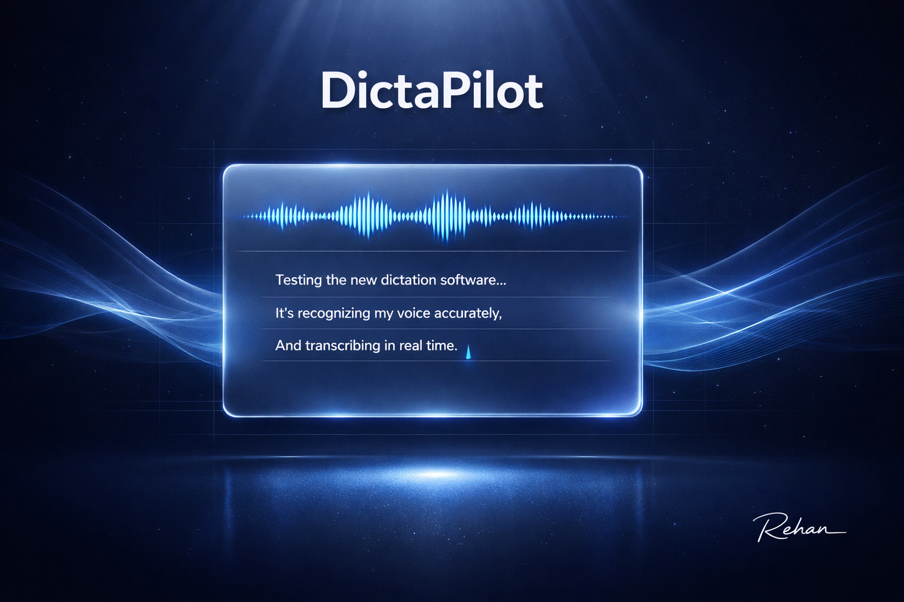

# DictaPilot3



[](https://www.python.org/downloads/)
[](LICENSE)


**Cross-platform voice dictation with smart editing.** Hold a hotkey, speak, release—your words appear instantly with intelligent cleanup and voice commands.

## ✨ Key Features

- **Hold-to-Talk** - Press F9, speak, release. That's it.
- **Real-Time Streaming** - See your words appear as you speak with live preview
- **Smart Voice Commands** - "delete that", "replace X with Y", "rewrite formal"
- **Delta Paste** - Only sends changed characters, not full text (faster, less flicker)
- **Context-Aware** - Different settings per application
- **Developer-Focused** - Agent mode for coding workflows
- **Privacy-First** - Local storage, open source

### Modern Floating Window UI
- **Glassmorphism Design** - Translucent glass effect with backdrop blur simulation
- **Smooth Animations** - Breathing, pulsing, and state transitions at 60 FPS
- **Accent Colors** - Choose blue, purple, or green themes
- **Accessibility** - Reduced motion support, classic mode fallback
- **2026 UI/UX** - Modern design principles with micro-interactions

## 🚀 Quick Start

**Get started in under 5 minutes:**

```bash
# 1. Clone repository
git clone https://github.com/RehanSajid136602/DictaPilot.git
cd DictaPilot

# 2. Run setup script
./setup/setup_linux.sh      # Linux
./setup/setup_macos.command  # macOS
setup\setup_windows.bat      # Windows

# 3. Add API key to .env
echo "GROQ_API_KEY=your_key_here" > .env

# 4. Start dictating
python app.py
```

**Get your free API key:** [console.groq.com](https://console.groq.com)

**Detailed guide:** [Quick Start Guide](docs/quick-start.md)

## 💻 Desktop GUI (New!)

Prefer a visual interface with **local transcription**? Use the DictaPilot GUI:

```bash
# Install GUI dependencies
pip install faster-whisper sounddevice soundfile PySide6

# Launch the GUI
python -m dictapilot_gui
```

**GUI Features:**
- 🎨 Modern WhisperFlow-inspired design
- 📝 Large transcription area with copy/save
- 🎙️ One-click recording with visual feedback
- 🔒 **Local transcription** - works offline, no API key needed
- ⚙️ Settings for model (tiny/base/small/medium), language, device
- 🌍 Multi-language support with auto-detection

**Why use the GUI?**
- No Groq API key required (uses local Whisper)
- Works completely offline after model download
- Visual feedback and easy editing
- Great for focused transcription sessions

**Note:** Models auto-download on first use. Choose `tiny` for speed, `medium` for accuracy.

## 📖 Documentation

### Getting Started
- **[Quick Start Guide](docs/quick-start.md)** - 5-step setup (< 5 minutes)
- **[Voice Commands](docs/voice-commands.md)** - Complete command reference
- **[Troubleshooting](docs/troubleshooting.md)** - Common issues and solutions
- **[FAQ](docs/faq.md)** - Frequently asked questions

### Platform Guides
- **[Linux Setup](docs/platform-guides/linux.md)** - X11/Wayland, backends, permissions
- **[macOS Setup](docs/platform-guides/macos.md)** - Accessibility, Keychain, backends
- **[Windows Setup](docs/platform-guides/windows.md)** - Permissions, backends, troubleshooting

### For Developers
- **[Architecture](docs/developer/architecture.md)** - System design overview
- **[API Reference](docs/developer/api-reference.md)** - Public API documentation
- **[Contributing Guide](docs/developer/contributing.md)** - Development setup and guidelines

## 🎯 How It Works

```
1. Hold F9 → Start recording
2. Speak naturally → Audio captured, streaming preview appears
3. Release F9 → Final transcription begins
4. Smart editing → Commands processed, text cleaned
5. Auto-paste → Text appears in your app
```

**Example:**
```
You say: "Hello world... um... delete that... Goodbye world"
Result: "Goodbye world"
```

**Real-Time Streaming:**
As you speak, a preview window shows your transcription in real-time. When you release the hotkey, a final accuracy pass ensures the best possible transcription quality.

## 🎤 Voice Commands

| Command | Action |
|---------|--------|
| `delete that` | Remove last segment |
| `clear all` | Clear everything |
| `replace X with Y` | Replace text |
| `rewrite formal` | Change tone |
| `fix grammar` | Correct grammar |
| `ignore` | Skip this utterance |

**See all commands:** [Voice Commands Reference](docs/voice-commands.md)

## ⚙️ Configuration

**Minimal setup:**
```bash
GROQ_API_KEY=your_key_here  # Required
HOTKEY=f9                   # Optional (default: f9)
```

**Common options:**
```bash
SMART_MODE=llm              # llm (accurate) or heuristic (fast)
PASTE_MODE=delta            # delta (fast) or full
DICTATION_MODE=accurate     # speed, balanced, or accurate
CLEANUP_LEVEL=aggressive    # basic, balanced, or aggressive
```

**40+ configuration options available.** See [Configuration Reference](#environment-variables) below.

## 🛠️ CLI Commands

```bash
python app.py --list              # List recent transcriptions
python app.py --stats             # View statistics
python app.py --search "query"    # Search transcriptions
python app.py --export file.txt   # Export to text file
```

## 🐛 Troubleshooting

**Hotkey not working?**
- Linux (X11): Try `HOTKEY_BACKEND=x11`
- Linux (Wayland): Try `HOTKEY_BACKEND=wayland` or `HOTKEY_BACKEND=pynput`
- macOS: Grant Accessibility permission
- Windows: Try running as administrator

**Text not pasting?**
- Linux (X11): Install xdotool: `sudo apt install xdotool`
- Linux (Wayland): Install wl-clipboard: `sudo apt install wl-clipboard wtype`
- macOS: Use `PASTE_BACKEND=osascript`
- Windows: Try `PASTE_BACKEND=pynput`

**Check Wayland dependencies:**
```bash
python app.py --wayland-deps
```

**More help:** [Troubleshooting Guide](docs/troubleshooting.md)

## 🗺️ Roadmap

**Phase 1 - Critical Foundations:**
- ✅ Improved documentation (in progress)
- ✅ Real-time streaming transcription
- ✅ Wayland support for Linux
- ✅ Modern GUI dashboard with local transcription

**Phase 2 - Competitive Advantages:**
- Enhanced agent mode with IDE integration
- Advanced delta paste optimization
- Context-aware profile enhancements

**Phase 3 - Mobile & Expansion:**
- Android companion app
- Optional cloud sync

**Full roadmap:** [plan.md](plan.md)

## 🤝 Contributing

We welcome contributions! See [Contributing Guide](docs/developer/contributing.md) for:
- Development setup
- Code style guidelines
- Testing requirements
- PR process

## 📦 Building Packages

```bash
./packaging/build_linux.sh        # Linux AppImage
./packaging/build_deb.sh          # Debian package
./packaging/build_macos.sh        # macOS bundle
.\packaging\build_windows.ps1     # Windows installer
```

## 🔧 Environment Variables

### Core Settings

| Variable | Default | Description |
|----------|---------|-------------|
| `GROQ_API_KEY` | _(required)_ | Groq API key from console.groq.com |
| `HOTKEY` | `f9` | Global hotkey for recording |
| `SMART_EDIT` | `1` | Enable smart editing (1/0) |
| `SMART_MODE` | `llm` | Editing mode: `llm` or `heuristic` |
| `PASTE_MODE` | `delta` | Paste mode: `delta` or `full` |

### Audio Settings

| Variable | Default | Description |
|----------|---------|-------------|
| `SAMPLE_RATE` | `16000` | Recording sample rate (Hz) |
| `AUDIO_DEVICE` | _(auto)_ | Audio device index |
| `TRIM_SILENCE` | `1` | Trim silence from recordings |

### Streaming Transcription

| Variable | Default | Description |
|----------|---------|-------------|
| `STREAMING_ENABLED` | `1` | Enable real-time streaming preview |
| `STREAMING_CHUNK_DURATION` | `1.5` | Audio chunk duration in seconds |
| `STREAMING_CHUNK_OVERLAP` | `0.3` | Overlap between chunks for accuracy |
| `STREAMING_MIN_CHUNKS` | `2` | Minimum chunks before showing preview |
| `STREAMING_FINAL_PASS` | `1` | Run final accuracy pass on complete audio |

**Streaming vs Batch Mode:**
- **Streaming** (default): See words as you speak, final accuracy pass ensures quality
- **Batch** (set `STREAMING_ENABLED=0`): Traditional mode - only transcribes after you release

### Modern Floating Window UI

| Variable | Default | Description |
|----------|---------|-------------|
| `FLOATING_UI_STYLE` | `modern` | UI style: `modern` or `classic` |
| `FLOATING_ACCENT_COLOR` | `blue` | Accent color: `blue`, `purple`, `green` |
| `FLOATING_GLASSMORPHISM` | `1` | Enable glassmorphism effect |
| `FLOATING_ANIMATIONS` | `1` | Enable smooth animations |
| `FLOATING_REDUCED_MOTION` | `0` | Accessibility: disable animations |
| `FLOATING_LAYOUT` | `pill` | Layout style: `pill`, `circular`, `card` |

**Modern UI Features:**
- **Glassmorphism**: Translucent backgrounds with multi-layer shadows
- **Animations**: 60 FPS breathing, pulsing, and state transitions
- **Accent Colors**: Blue (professional), Purple (creative), Green (positive)
- **Accessibility**: Reduced motion support, classic mode fallback

**See full guide:** [Modern UI Guide](docs/modern-ui-guide.md)

### Backend Selection

| Variable | Default | Description |
|----------|---------|-------------|
| `HOTKEY_BACKEND` | `auto` | Hotkey backend: `auto`, `keyboard`, `pynput`, `x11`, `wayland` |
| `PASTE_BACKEND` | `auto` | Paste backend: `auto`, `keyboard`, `pynput`, `xdotool`, `x11`, `wayland`, `osascript` |
| `DISPLAY_SERVER` | `auto` | Display server override: `auto`, `x11`, `wayland` |

### Advanced Settings

| Variable | Default | Description |
|----------|---------|-------------|
| `DICTATION_MODE` | `accurate` | Mode: `speed`, `balanced`, `accurate` |
| `CLEANUP_LEVEL` | `aggressive` | Cleanup: `basic`, `balanced`, `aggressive` |
| `INSTANT_REFINE` | `1` | Fast paste then background refinement |
| `GROQ_WHISPER_MODEL` | `whisper-large-v3-turbo` | Transcription model |

**See all 40+ options:** Check `.env.example` or [Configuration Guide](docs/quick-start.md#configuration)

## 📂 Storage Locations

| Data | Linux/macOS | Windows |
|------|-------------|---------|
| Transcriptions | `~/.local/share/dictapilot/` | `%APPDATA%\DictaPilot\` |
| Configuration | `~/.config/dictapilot/` | `%APPDATA%\DictaPilot\` |

## 📄 License

MIT License - see [LICENSE](LICENSE) file.

## 🙏 Credits

**Original Author:** [Rohan Sharvesh](https://github.com/RohanSharvesh)  
**Fork Maintainer:** Rehan  
**Original Project:** [WhisperGroq](https://github.com/rohansharvesh/WhisperGroq)

## 🔗 Links

- **Documentation:** [docs/](docs/)
- **Issues:** [GitHub Issues](https://github.com/RehanSajid136602/DictaPilot/issues)
- **Discussions:** Coming soon
- **Discord:** Planned

---

**Made with ❤️ for developers who prefer speaking to typing.**
