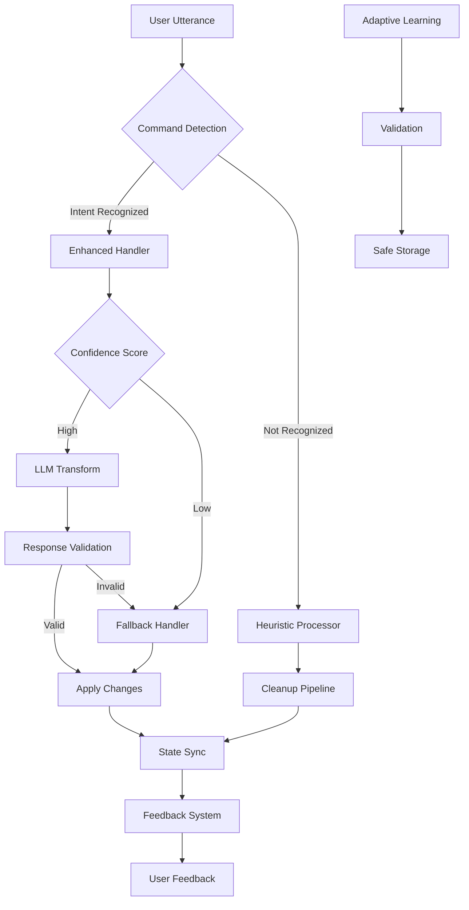

# Smart Editor Improvement Plan

## Executive Summary

This plan outlines enhancements to make the DictaPilot Smart Editor more **robust**, **user-friendly**, **accurate**, and **consistent**. Additionally, it includes UI enhancements for the floating window audio bar with state-based color animation.

---

## Current State Analysis

### Strengths
- Comprehensive command recognition (delete, undo, clear, ignore, replace)
- Inline self-correction handling ("no, no, not X use Y")
- Confidence-aware cleanup levels
- Personal and adaptive dictionary support
- Snippet management
- LLM integration for complex transformations
- Multi-platform paste backend support
- Animated floating window with audio visualization

### Weaknesses Identified

| Category | Issue | Impact |
|----------|-------|--------|
| **Robustness** | No fallback when LLM fails | Complete transformation failure |
| **Robustness** | Segment sync can lose state | Inconsistent output text |
| **Robustness** | Adaptive dictionary has no validation | Corrupted learning data |
| **Accuracy** | Inline correction regex is brittle | Wrong self-corrections |
| **Accuracy** | Overlap detection limited to 3 tokens | Misses longer overlaps |
| **Consistency** | Heuristic vs LLM produces different punctuation | Confusing behavior |
| **Consistency** | No canonical state validation | State drift over time |
| **UX** | Verbose debug logging in production | Log spam |
| **UX** | No user feedback mechanism | Unclear what happened |
| **UX** | Limited command vocabulary | Users must learn exact phrases |
| **UI** | Audio bar colors are neutral (gray/white) | No clear state indication |
| **UI** | Colors don't match standard recording conventions | User confusion |

---

## Improvement Areas

### 1. Command Recognition Enhancement

#### 1.1 Expand Command Vocabulary
```python
# Current limited set - expand to include natural variations
NEW_COMMAND_PATTERNS = {
    "delete_last": [
        r"undo last(?: sentence)?",
        r"delete last(?: sentence|word|piece)?",
        r"remove last(?: sentence|word)?",
        r"take back(?: the last)?",
        r"oops delete that",
    ],
    "replace_word": [
        r"change (\w+) to (\w+)",
        r"swap (\w+) with (\w+)",
        r"(\w+) instead of (\w+)",
    ],
    "capitalize": [
        r"capitalize(?: that| last)?",
        r"make (?:that|last) capitalized",
        r"uppercase (?:that|last)",
    ],
}
```

#### 1.2 Fuzzy Matching for Commands
- Add Levenshtein distance calculation for near-miss commands
- Threshold: 2 character difference for short commands (<8 chars)
- Example: "deleet that" → "delete that"

#### 1.3 Command Intent Classification
```python
def classify_command_intent(utterance: str) -> CommandIntent:
    """Classify the user's intent behind a command."""
    patterns = {
        "correction": ["no", "not", "sorry", "oops"],
        "removal": ["delete", "remove", "undo", "scratch"],
        "addition": ["add", "insert", "append"],
        "modification": ["change", "replace", "fix"],
    }
```

---

### 2. Inline Correction Improvement

#### 2.1 Enhanced Self-Correction Detection
```python
# More robust patterns for self-corrections
_SELF_CORRECTION_PATTERNS = [
    (r"\bno(?:,?\s*no)*\s*,?\s*(?:i mean|actually|wait)\s+(.+)", "replace_with_following"),
    (r"\bnot\s+(\w+)\s*,?\s*(?:use|with|but|rather)\s+(\w+)", "swap_words"),
    (r"\b(\w+)\s*,\s*\1\s+(?:not|no)\s+(\w+)", "negation_swap"),
]
```

#### 2.2 Context-Aware Correction
- Use surrounding words to disambiguate corrections
- Match semantic meaning, not just surface forms
- Example: "the the the" → context-dependent deduplication

---

### 3. State Management Enhancement

#### 3.1 Canonical State Validation
```python
def validate_state_consistency(state: TranscriptState) -> bool:
    """Ensure segments and output_text are always consistent."""
    reconstructed = _join_segments(state.segments)
    return reconstructed == state.output_text
```

#### 3.2 Auto-Correction of State
```python
def sync_state(state: TranscriptState) -> None:
    """Automatically fix inconsistent state."""
    if not validate_state_consistency(state):
        # Rebuild from source of truth
        state.output_text = _join_segments(state.segments)
```

#### 3.3 Persistent Undo Stack
```python
@dataclass
class UndoEntry:
    timestamp: float
    previous_output: str
    action_type: str
    command_used: Optional[str]

class EnhancedTranscriptState(TranscriptState):
    undo_stack: List[UndoEntry] = field(default_factory=list)
    max_undo_levels: int = 20
```

---

### 4. LLM Integration Improvements

#### 4.1 Graceful Degradation
```python
def llm_transform_with_fallback(
    prev_output: str,
    utterance: str,
    context: DictationContext,
) -> Tuple[str, str]:
    """Try LLM first, fall back to heuristics on failure."""
    try:
        return _llm_updated_transcript(...)
    except LLMError:
        logger.warning("LLM failed, using heuristic fallback")
        return apply_heuristic_fallback(...)
```

#### 4.2 LLM Response Validation
```python
@dataclass
class LLMResponse:
    updated_transcript: str
    action: str
    confidence: float  # New: confidence score

def validate_llm_response(response: dict) -> Optional[LLMResponse]:
    """Validate and normalize LLM JSON response."""
```

#### 4.3 Caching for Repeated Commands
```python
_LLM_CACHE: Dict[str, Tuple[str, float]] = {}
_CACHE_TTL = 300  # 5 minutes

def cached_llm_transform(command: str, context_hash: str) -> Optional[str]:
    """Cache repeated transformation commands."""
```

---

### 5. Adaptive Learning Improvements

#### 5.1 Validation Before Learning
```python
def validate_adaptive_learning(target: str, replacement: str) -> bool:
    """Validate before adding to adaptive dictionary."""
    # Check for minimum length
    if len(target) < 2 or len(replacement) < 2:
        return False
    # Check for obvious errors
    if target.lower() == replacement.lower():
        return False
    # Check for patterns that look like errors
    if _looks_like_transcription_error(target):
        return False
```

#### 5.2 Learning Rate Limiting
```python
_MAX_LEARNING_PER_SESSION = 10
_LEARNING_COOLDOWN = 3600  # 1 hour
```

#### 5.3 Rollback Mechanism
```python
def rollback_adaptive_learning(entry_key: str) -> bool:
    """Remove a learning entry if it causes issues."""
```

---

### 6. Cleanup Algorithm Enhancement

#### 6.1 Multi-Level Cleanup Pipeline
```python
class CleanupPipeline:
    stages = [
        ("filler_words", _remove_filler_words),
        ("repeated_tokens", _dedupe_tokens),
        ("repeated_phrases", _dedupe_phrases),
        ("punctuation", _fix_punctuation),
        ("capitalization", _capitalize_sentences),
        ("trailing", _normalize_end),
    ]
    
    def run(self, text: str, level: str) -> str:
        """Run cleanup through configurable pipeline."""
```

#### 6.2 Confidence-Adaptive Cleanup
```python
def adaptive_cleanup(text: str, confidence: float) -> str:
    """Adjust cleanup aggressiveness based on confidence."""
    if confidence > 0.9:
        return aggressive_cleanup(text)
    elif confidence > 0.7:
        return balanced_cleanup(text)
    else:
        return conservative_cleanup(text)
```

---

### 7. User Experience Improvements

#### 7.1 Unified Feedback System
```python
class EditorFeedback:
    def __init__(self):
        self.last_action: Optional[str] = None
        self.last_change: Optional[str] = None
        self.warnings: List[str] = []
    
    def format_message(self) -> str:
        """Format a user-friendly feedback message."""
```

#### 7.2 Command Echo
- After each command, provide brief confirmation
- Example: "Deleted last sentence" or "Ignored"

#### 7.3 Error Recovery Suggestions
- When command fails, suggest alternatives
- Example: "Didn't understand. Try 'delete last sentence' or 'undo'"

---

### 8. Testing Enhancement

#### 8.1 Expand Test Corpus
```json
// tests/fixtures/smart_editor_corpus.jsonl additions
{"utterance": "um um this this is is a test", "expected": "This is a test."}
{"utterance": "no not that use this", "expected": "this"}
{"utterance": "delete the word hello", "expected": ""}
{"utterance": "change foo to bar", "expected": "bar"}
```

#### 8.2 Property-Based Testing
```python
@pytest.mark.property
def test_cleanup_idempotent(text):
    """Cleanup should be idempotent."""
    once = smart_cleanup(text)
    twice = smart_cleanup(once)
    assert once == twice
```

#### 8.3 Integration Tests
```python
def test_full_dictation_session():
    """Test complete dictation flow with commands."""
    state = TranscriptState()
    commands = [
        ("hello world", "append"),
        ("um that is is wrong", "append"),
        ("undo last", "undo"),
        ("clear all", "clear"),
    ]
```

---

## Implementation Roadmap

### Phase 1: Foundation (Week 1)
- [ ] Add state validation and sync functions
- [ ] Implement LLM fallback mechanism
- [ ] Add adaptive learning validation
- [ ] Create feedback system structure
- [ ] Write tests for state management

### Phase 2: Core Improvements (Week 2)
- [ ] Expand command vocabulary with fuzzy matching
- [ ] Enhance inline correction detection
- [ ] Implement multi-level cleanup pipeline
- [ ] Add command intent classification
- [ ] Write tests for new patterns

### Phase 3: Polish (Week 3)
- [ ] Add user feedback messages
- [ ] Implement command echo
- [ ] Add error recovery suggestions
- [ ] Create property-based tests
- [ ] Performance optimization

### Phase 4: Validation (Week 4)
- [ ] Full integration testing
- [ ] User acceptance testing
- [ ] Performance benchmarking
- [ ] Documentation updates
- [ ] Release preparation

---

## Migration Strategy

### Backward Compatibility
- All existing commands continue to work
- Environment variables remain unchanged
- JSON file formats are additive (new keys optional)

### Gradual Rollout
1. Enable new features behind feature flags
2. Collect telemetry on new behaviors
3. Compare old vs new results
4. Gradually enable by default

---

## Success Metrics

| Metric | Current | Target |
|--------|---------|--------|
| Command recognition accuracy | ~85% | >95% |
| State consistency errors | Unknown | 0% |
| LLM fallback usage | N/A | <5% |
| User command success rate | Unknown | >90% |
| Test coverage | ~60% | >85% |

---

## Risks and Mitigations

| Risk | Impact | Mitigation |
|------|--------|------------|
| Over-correction of user corrections | High | Conservative defaults, opt-in features |
| Performance regression | Medium | Benchmarking, performance tests |
| Breaking existing workflows | High | Backward compatibility, gradual rollout |
| LLM dependency increase | Medium | Robust fallback to heuristics |

---

## Files to Modify

1. **`smart_editor.py`** - Main implementation
2. **`tests/test_smart_editor.py`** - Add new test cases
3. **`tests/fixtures/smart_editor_corpus.jsonl`** - Expand corpus
4. **`docs/implementation-plan.md`** - Update with new features
5. **`README.md`** - Document new commands
6. **`app.py`** - Floating window audio bar color animation

---

## UI Enhancement: Audio Bar State Colors

### Goal
Add color-coded audio bar visualization to the floating window that clearly indicates the current recording state:

| State | Color | Description |
|-------|-------|-------------|
| **Recording** | Blue (#3b82f6) | User is holding the hotkey and dictating |
| **Processing** | Yellow (#eab308) | Audio is being sent for transcription |
| **Complete** | Green (#22c55e) | Transcription is complete |
| **Idle** | Gray (#cbd5e1) | System is ready but not recording |

### Implementation Details

#### 9.1 Color Constants
```python
# In app.py - Add color constants for each state
AUDIO_BAR_COLORS = {
    "recording": {
        "top": QColor("#3b82f6"),      # Blue-500
        "bottom": QColor("#1d4ed8"),   # Blue-700
        "glow": QColor(59, 130, 246, 88),  # Blue with alpha
    },
    "processing": {
        "top": QColor("#eab308"),      # Yellow-500
        "bottom": QColor("#ca8a04"),   # Yellow-600
        "glow": QColor(234, 179, 8, 64),   # Yellow with alpha
    },
    "complete": {
        "top": QColor("#22c55e"),      # Green-500
        "bottom": QColor("#16a34a"),   # Green-600
        "glow": QColor(34, 197, 94, 76),   # Green with alpha
    },
    "idle": {
        "top": QColor("#cbd5e1"),      # Slate-300
        "bottom": QColor("#475569"),   # Slate-600
        "glow": QColor(203, 213, 225, 56), # Slate with alpha
    },
}
```

#### 9.2 Mode Mapping
```python
# Map internal modes to color states
def _get_color_state(mode: str) -> str:
    """Map GUI mode to color state."""
    mapping = {
        "record": "recording",
        "recording": "recording",
        "processing": "processing",
        "transcribing": "processing",
        "done": "complete",
        "complete": "complete",
        "idle": "idle",
    }
    return mapping.get(mode, "idle")
```

#### 9.3 Updated Paint Logic
```python
# In _paint_window method, replace the color selection:
def _paint_window(self, window):
    painter = QPainter(window)
    painter.setRenderHint(QPainter.Antialiasing, True)
    
    # Get color state based on current mode
    color_state = _get_color_state(self._mode)
    colors = AUDIO_BAR_COLORS[color_state]
    
    top_color = colors["top"]
    bottom_color = colors["bottom"]
    glow_color = colors["glow"]
    
    # ... rest of paint logic unchanged ...
```

#### 9.4 Pulsing Effect for Active States
```python
def _get_pulse_factor(self, color_state: str) -> float:
    """Get pulsing animation factor for active states."""
    if color_state == "recording":
        # Fast pulse while recording
        return 0.9 + 0.1 * np.sin(time.time() * 8.0)
    elif color_state == "processing":
        # Medium pulse while processing
        return 0.85 + 0.15 * np.sin(time.time() * 4.0)
    elif color_state == "complete":
        # Slow pulse when complete
        return 0.92 + 0.08 * np.sin(time.time() * 2.0)
    return 1.0
```

#### 9.5 Configuration Options
```python
# Environment variables for customization
ENABLE_COLOR_ANIMATION = os.getenv("ENABLE_COLOR_ANIMATION", "1").strip().lower() not in {"0", "false", "no"}
COLOR_THEME = os.getenv("COLOR_THEME", "default").strip().lower()  # default, high_contrast
```

### Testing
```python
def test_audio_bar_colors():
    """Test that audio bar colors match state requirements."""
    gui = GUIManager()
    
    # Test recording state - should be blue
    gui._mode = "record"
    colors = gui._get_color_state("record")
    assert colors == "recording"
    
    # Test processing state - should be yellow
    gui._mode = "processing"
    colors = gui._get_color_state("processing")
    assert colors == "processing"
    
    # Test complete state - should be green
    gui._mode = "done"
    colors = gui._get_color_state("done")
    assert colors == "complete"
```

### Tasks
- [ ] Add color constants to app.py
- [ ] Create _get_color_state function
- [ ] Update _paint_window to use state-based colors
- [ ] Add pulsing effects for active states
- [ ] Add configuration options
- [ ] Write tests for color transitions
- [ ] Update documentation

---

## Mermaid: Improved Architecture



---

## Conclusion

This plan provides a structured approach to making the Smart Editor more robust, accurate, and user-friendly. The improvements build on the existing solid foundation while addressing the identified weaknesses through incremental, well-tested changes.
